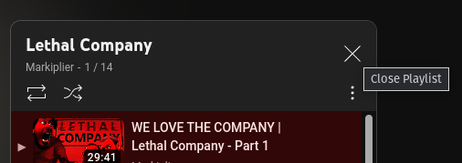

# YouTube Playlist Close

A userscript to make closing playlists easier. Keeps the video you were watching and your position in it.

To install, make sure you have [userscript support](https://greasyfork.org/en/help/installing-user-scripts) and go to [the raw script](https://github.com/Trainmaster2/YouTube-Playlist-Close/raw/master/YouTube%20Playlist%20Close.user.js).
